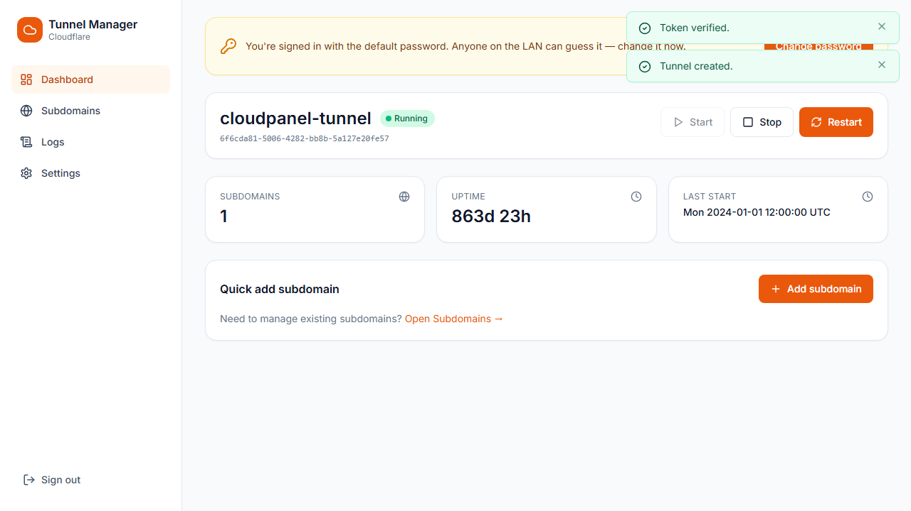
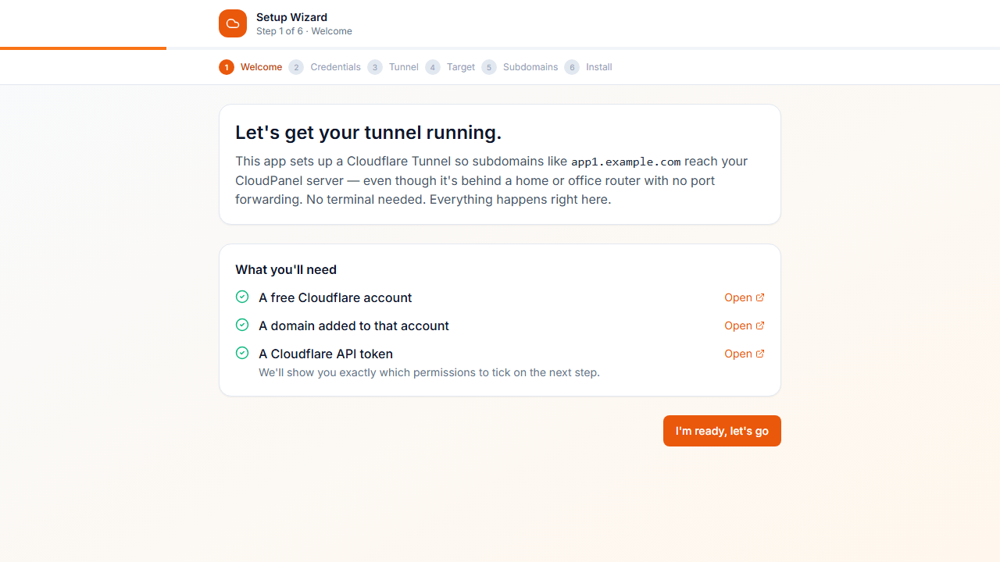
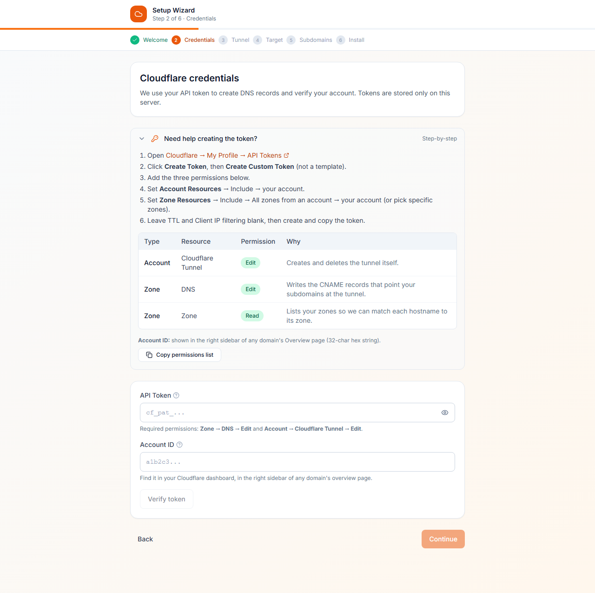
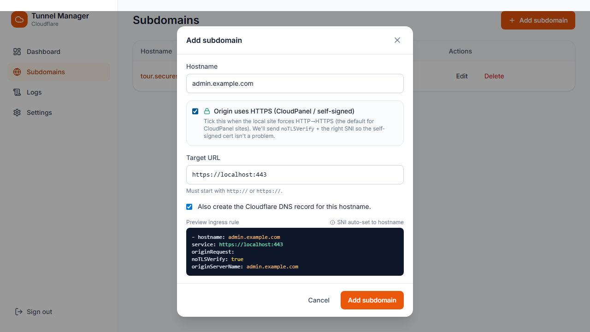
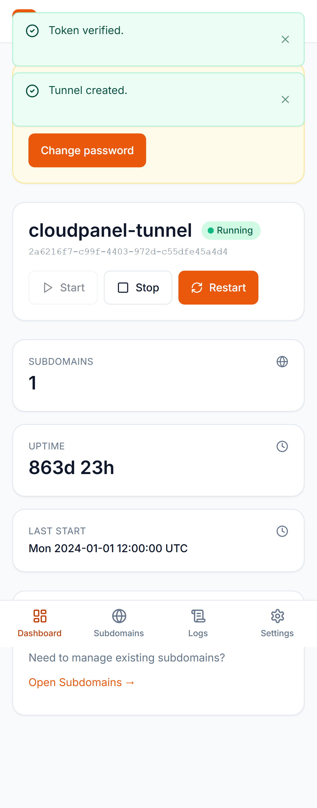

# Cloudflare Tunnel Manager

A UI-first web app for setting up and managing **Cloudflare Tunnels** that expose a [CloudPanel](https://www.cloudpanel.io/) server — or any internal service — sitting behind NAT. No CLI knowledge required. Install once, open a browser, and walk through the setup wizard.

- 🚀 First-run wizard installs and starts the tunnel for you
- 📱 Mobile-first responsive UI (works great on phones and tablets)
- 🔐 JWT-based admin login
- 🌐 Add, edit, delete subdomains from the UI — DNS records auto-created in Cloudflare
- 🔒 One-click "Origin uses HTTPS" mode for CloudPanel's self-signed cert
- 📜 Live log streaming via `journalctl -u cloudflared`
- 🧪 20+ Playwright tests, desktop + mobile viewports



---

## One-shot install

On a fresh Ubuntu 22.04 / 24.04 or Debian 12 box:

```bash
curl -sSL https://raw.githubusercontent.com/bpbonker/cloudflared-ui/main/scripts/install.sh | bash
```

The installer takes care of Node 20, cloudflared, the system user, sudoers rules, the systemd service, and a fresh `.env` with a random `JWT_SECRET`. Open `http://<server-ip>:8088` and sign in with `admin` / `changeme`.

### Manual install

```bash
git clone https://github.com/bpbonker/cloudflared-ui.git
cd cloudflared-ui
cp .env.example .env
# edit JWT_SECRET and ADMIN_PASSWORD in .env
npm run install:all
npm run build
npm start
```

## Walkthrough

### 1. First-run wizard

The app detects no tunnel is configured and drops you into a six-step wizard.

| Welcome | Credentials |
|---|---|
|  |  |

Each step is gated until the previous one succeeds, so you can't get stuck halfway. The credentials step includes an inline cheat-sheet for which permissions to tick on your Cloudflare API token.

### 2. Add subdomains

For each public hostname, the app writes an ingress rule and (optionally) the matching Cloudflare DNS CNAME. Toggle **Origin uses HTTPS** for CloudPanel sites that force HTTP→HTTPS internally — it sets `noTLSVerify` and the right SNI so the tunnel doesn't loop.



### 3. Manage everything from a tablet or phone

Bottom-nav on mobile, sidebar on desktop, table on wide viewports, cards on narrow ones.



---

## Cloudflare API token

The wizard needs an API token with these permissions. Use **Create Custom Token** (not a built-in template):

| Type    | Resource           | Permission |
|---------|--------------------|------------|
| Account | Cloudflare Tunnel  | **Edit**   |
| Zone    | DNS                | **Edit**   |
| Zone    | Zone               | **Read**   |

**Account Resources:** Include → your account
**Zone Resources:** Include → All zones from an account → your account

Create at [dash.cloudflare.com → My Profile → API Tokens](https://dash.cloudflare.com/profile/api-tokens). The same checklist is shown inline in the wizard.

## SSL/TLS — the punchline

You don't generate certs. Cloudflare's edge terminates TLS with their universal cert, the tunnel encrypts the cloudflared↔edge hop, and your origin can serve plain HTTP. **Don't click the "Issue Let's Encrypt" button in CloudPanel** — port 80 isn't internet-reachable, so HTTP-01 challenges will fail. Set Cloudflare SSL/TLS mode to **Full** or **Full (strict)** for each zone.

For CloudPanel sites that *internally* force HTTP→HTTPS (the default), tick the **Origin uses HTTPS** toggle in the add-subdomain form and the tunnel will route to `https://localhost:443` with the right SNI.

## Project layout

```
cloudflared-ui/
├── server/
│   ├── index.js              # Express entry, also serves the built client
│   ├── routes/               # auth, setup, tunnel, ingress, dns, logs, settings, target, service, system
│   ├── lib/                  # cloudflare-api, config (yaml read/write), shell, store (json state)
│   └── middleware/auth.js    # JWT
├── client/
│   ├── src/
│   │   ├── pages/Setup/      # 6-step wizard
│   │   ├── pages/            # Dashboard, Subdomains, Logs, Settings, Login
│   │   ├── components/       # Nav, StatusBadge, SubdomainCard, LogViewer, Modal, Toast, TokenPermissionsHelper
│   │   └── lib/api.js
├── scripts/
│   └── install.sh            # one-shot installer for Ubuntu/Debian
├── tests/                    # Playwright e2e suite (desktop + mobile)
├── .env.example
└── README.md
```

## Sudoers rules

The app calls `systemctl`, `journalctl`, and `cloudflared` via `sudo -n` so it can install/start/stop the service from the UI. The installer drops this in `/etc/sudoers.d/cloudflared-ui` — replace `cfui` with whichever user runs the app:

```
cfui ALL=(root) NOPASSWD: /usr/bin/systemctl start cloudflared, \
                         /usr/bin/systemctl stop cloudflared, \
                         /usr/bin/systemctl restart cloudflared, \
                         /usr/bin/systemctl enable cloudflared, \
                         /usr/bin/systemctl disable cloudflared, \
                         /usr/bin/systemctl status cloudflared, \
                         /usr/bin/systemctl show cloudflared, \
                         /usr/bin/journalctl -u cloudflared *, \
                         /usr/local/bin/cloudflared service install, \
                         /usr/local/bin/cloudflared service uninstall, \
                         /usr/local/bin/cloudflared tunnel *
```

Then `sudo visudo -c -f /etc/sudoers.d/cloudflared-ui` to validate.

## Running this app behind its own tunnel

You can expose the management UI publicly through the same tunnel. Add a hostname (e.g. `admin.example.com`) pointing at `http://localhost:8088`. Then strongly recommended: enable Cloudflare Access in front of it, so only your Cloudflare-authenticated identity can hit the management UI.

## Mock mode

Set `MOCK_MODE=true` in `.env` to fake every shell call (`cloudflared`, `systemctl`, `journalctl`) and Cloudflare API call. The wizard runs end-to-end without touching anything real — useful for UI development on a Windows or macOS laptop, and what the Playwright suite runs against.

## Tests

```bash
cd tests
npm install
npx playwright install chromium
E2E_BASE_URL=http://your-host:8088 npx playwright test
```

The suite covers login (good/bad creds), the full wizard end-to-end, every authed page on desktop + mobile, the HTTPS-origin toggle round-tripping through the API, and the edit-modal pre-filling existing rules.

## Troubleshooting

**Tunnel won't start.** Open **Logs** in the app:
- *"sudo: a password is required"* — sudoers rules aren't installed for the app user (see above)
- *"cloudflared: not found"* — install cloudflared (the Dashboard banner has the exact command)
- *"service is already installed"* — the wizard auto-recovers from this on the next attempt

**Hostname returns "too many redirects".** CloudPanel's vhost forces HTTP→HTTPS and your tunnel is pointing at HTTP. Edit the subdomain in the UI and tick **Origin uses HTTPS**.

**Tunnel returns 502 with "tls: unrecognized name".** Same fix — tick **Origin uses HTTPS**. cloudflared was sending SNI=`localhost` and the origin nginx wants the public hostname.

**App can't reach CloudPanel.** Use **Settings → CloudPanel target → Test connection**. The check is a TCP connect — if it fails the app isn't on a network that can reach CloudPanel.

**Lost admin password.** Stop the app, delete `data/auth.json`, restart. The login falls back to the `.env` credentials again.

## License

Apache-2.0 — see [LICENSE](LICENSE).
